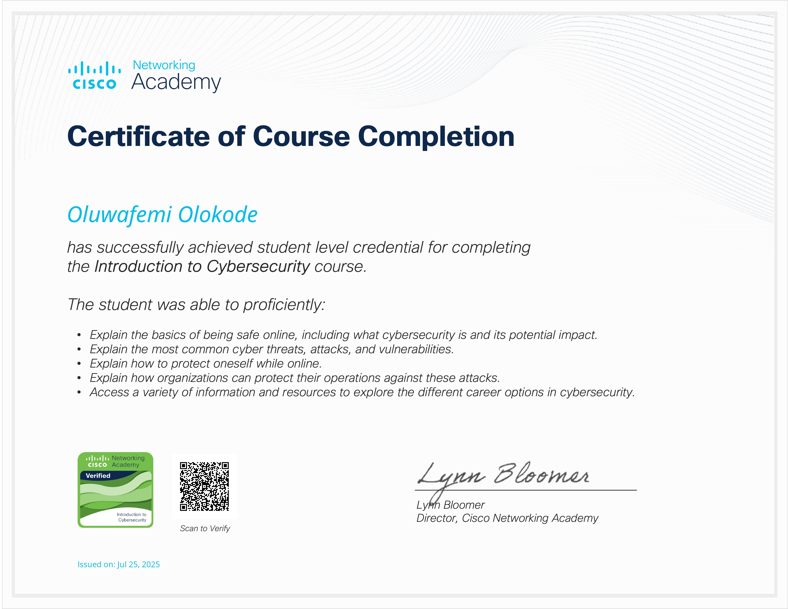

Introduction to Cybersecurity – Cisco NetAcad

Welcome to my cybersecurity learning journey!  
This repo documents my progress through Cisco Networking Academy's "Introduction to Cybersecurity" course.

## 📘 Module Notes

Click to read summaries of what I learned:

- [Module 1: Introduction to Cybersecurity](./netacad-notes/module-1-introduction-to-cyber-security.md)
- [Module 2: What You Will Be Protecting](./netacad-notes/module-2-attacks-concepts.md)
- [Module 3: Understanding the Threat Landscape](./netacad-notes/module-3-protecting-your-data.md)
- [Module 4: Protecting the Organisation](./netacad-notes/module-4-protecting-your-organization.md)
- [Module 5: Will Your Future Be in Cybersecurity](./netacad-notes/module-5-will-your-future-be-in-cyber-security.md)

---

## 🎓 Certificate

